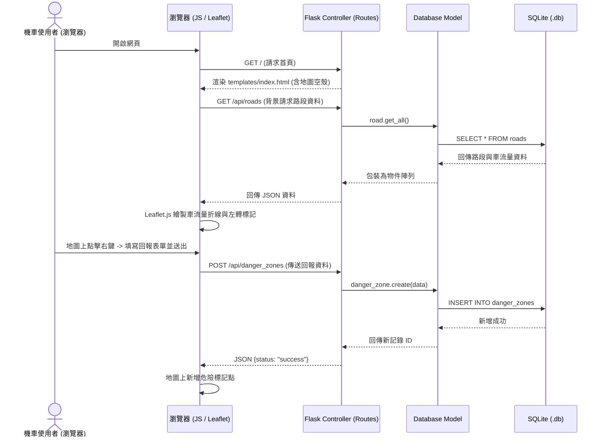

# 城市機車友善地圖與車流量查詢系統 - 系統架構設計 (ARCHITECTURE)

本文件說明本專案的技術選型、目錄結構、元件關係與關鍵設計決策，供開發與維護團隊參考。

## 1. 技術架構說明

本系統採用 **Flask** 框架搭配 **Jinja2** 模板引擎與 **SQLite** 資料庫，遵循經典的 **MVC (Model-View-Controller)** 設計模式。

*   **Model (模型層)**：由 `app/models/` 負責。直接透過 Python 的 `sqlite3` 套件連接 SQLite 資料庫。由於專案規模適中且效能考量，我們使用原生 SQL 進行資料操作，並設定 `row_factory = sqlite3.Row` 以字典鍵值對方式存取欄位，提高開發效率。
*   **View (視圖層)**：由 `app/templates/` (Jinja2 HTML 模板) 與 `app/static/` (CSS/JS 靜態資源) 負責。Jinja2 將後端控制器傳遞的變數與邏輯渲染成瀏覽器可解析的 HTML。前端使用 **Leaflet.js** 地圖套件與 **Bootstrap 5**，提供現代、響應式且美觀的機車友善互動介面。
*   **Controller (控制器層)**：由 `app/routes/` 負責。使用 Flask 的 Blueprint 區分主頁面（`main.py`）與 JSON API 介面（`api.py`），接收並驗證使用者請求，呼叫 Model 取得/更新資料，最後決定要渲染的模板或回傳 JSON 資料。

---

## 2. 專案資料夾結構

本專案目錄結構設計如下，保持職責分離與清晰的模組劃分：

```text
fcumotomap/
├── app/
│   ├── __init__.py          # Flask App 初始化與資料庫重設函式
│   ├── models/              # 資料庫操作 (Model)
│   │   ├── __init__.py
│   │   ├── road.py          # 路段、車流量與左轉提示邏輯
│   │   └── danger_zone.py   # 危險路段評分、投票與留言邏輯
│   ├── routes/              # 路由控制器 (Controller)
│   │   ├── __init__.py
│   │   ├── main.py          # 前端網頁路由
│   │   └── api.py           # 地圖與投票 AJAX API 路由
│   ├── static/              # 靜態資源 (View)
│   │   ├── css/
│   │   │   └── style.css    # 精美 Glassmorphism 樣式
│   │   └── js/
│   │       └── map.js       # Leaflet.js 地圖操作與 API 串接
│   └── templates/           # Jinja2 模板 (View)
│       ├── base.html        # 共用基礎版型
│       ├── index.html       # 地圖主頁
│       └── danger_zone_detail.html # 危險路段詳情、投票與留言
├── database/
│   └── schema.sql           # SQLite 資料表結構與逢甲大學周邊初始資料
├── docs/
│   ├── PRD.md               # 產品需求文件
│   ├── ARCHITECTURE.md      # 本架構設計文件
│   ├── FLOWCHART.md         # 系統與使用者流程圖
│   ├── DB_DESIGN.md         # 資料庫 Schema 設計與 ER 圖
│   └── ROUTES.md            # 路由與 API 詳細設計
├── instance/
│   └── database.db          # SQLite 實體資料庫 (自動生成，不進入 Git)
├── app.py                   # 專案入口點
├── requirements.txt         # 套件依賴清單
└── README.md                # 專案說明文件
```

---

## 3. 元件關係圖

以下展示使用者瀏覽器、Flask Route、Model 以及 SQLite 資料庫之間的資料流向關係：

### 系統元件資料流 (Mermaid Sequence)


---

## 4. 關鍵設計決策

1.  **無 Key 的 Leaflet.js 地圖方案**：
    *   *決策*：採用 Leaflet.js 結合 OpenStreetMap。
    *   *原因*：比起 Google Maps API 需要註冊信用卡並綁定 API 金鑰，Leaflet.js 完全開源且免付費，避免金鑰洩漏風險，非常適合課堂專題與本機快速展示。
2.  **前端非同步資料加載 (AJAX)**：
    *   *決策*：頁面初次載入僅渲染 HTML 骨架與 CSS，地圖的路段（車流量）、危險點標記等資料，皆在頁面載入後透過 JavaScript 向 `/api/*` 發送 `fetch` 非同步請求取得。
    *   *原因*：避免資料庫龐大時拖慢首頁首畫面載入速度，提升使用者體驗，地圖上的篩選與縮放操作也不需重新整理整頁。
3.  **不引入龐大 ORM 的原生 SQLite**：
    *   *決策*：使用 Python 原生 `sqlite3` 與 `schema.sql` 進行手動資料庫管理，不使用 SQLAlchemy。
    *   *原因*：因應非功能性需求中的初學者閱讀性，手寫 SQL 能更直觀看懂表結構，且更能完全掌控 SQL 查詢，減輕學習負擔。
4.  **地圖折線 (Polyline) 儲存設計**：
    *   *決策*：在資料庫中以 TEXT 格式儲存 JSON 字串（緯度/經度座標點陣列，例如 `[[24.1786, 120.6468], [24.1798, 120.6472]]`）。
    *   *原因*：SQLite 不支援複雜的空間地理格式，將折線座標字串化後存入 TEXT，前端取出時直接 `JSON.parse` 即可完美給 Leaflet.js 繪製路段。
