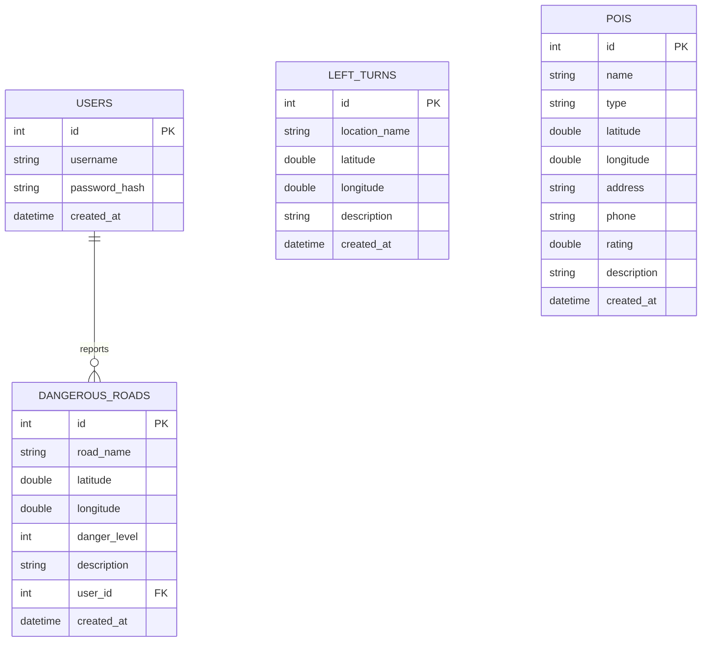

# 城市機車友善地圖系統 - 資料庫設計文件 (DB_DESIGN)

本文件描述系統的 SQLite 資料庫設計，包含實體關係圖 (ERD)、欄位規格說明、建表 SQL 語法及後端 Python Model 的架構。

## 1. 實體關係圖 (ERD)

我們規劃了四個主要資料表：
- `users`: 使用者資料表，用於帳號管理與回報者追蹤。
- `left_turns`: 標記需要兩段式左轉的危險/重要路口。
- `dangerous_roads`: 使用者回報的危險路段評分與星級。
- `pois`: 機車友善與安全推薦點位資料表（機車行、加油站、換電站、停車場）。



---

## 2. 資料表詳細說明

### 2.1 USERS (使用者)
| 欄位名稱 | 資料型別 | 屬性 | 說明 |
| :--- | :--- | :--- | :--- |
| `id` | INTEGER | PK, AUTOINCREMENT | 使用者唯一編號 |
| `username` | TEXT | UNIQUE, NOT NULL | 使用者帳號 (如學號或自訂名稱) |
| `password_hash` | TEXT | NOT NULL | 加密後的密碼雜湊值 |
| `created_at` | DATETIME | NOT NULL | 帳號建立時間 (預設 `CURRENT_TIMESTAMP`) |

### 2.2 LEFT_TURNS (兩段式左轉路口)
| 欄位名稱 | 資料型別 | 屬性 | 說明 |
| :--- | :--- | :--- | :--- |
| `id` | INTEGER | PK, AUTOINCREMENT | 路口唯一編號 |
| `location_name` | TEXT | NOT NULL | 路口/路段名稱描述 |
| `latitude` | REAL | NOT NULL | 緯度座標 |
| `longitude` | REAL | NOT NULL | 經度座標 |
| `description` | TEXT | NULL | 額外說明提示 (例如：待轉區偏小、尖峰車流多) |
| `created_at` | DATETIME | NOT NULL | 建立時間 (預設 `CURRENT_TIMESTAMP`) |

### 2.3 DANGEROUS_ROADS (危險路段評價)
| 欄位名稱 | 資料型別 | 屬性 | 說明 |
| :--- | :--- | :--- | :--- |
| `id` | INTEGER | PK, AUTOINCREMENT | 記錄唯一編號 |
| `road_name` | TEXT | NOT NULL | 危險路段/路口名稱 |
| `latitude` | REAL | NOT NULL | 緯度座標 |
| `longitude` | REAL | NOT NULL | 經度座標 |
| `danger_level` | INTEGER | NOT NULL | 危險星級星等 (1 - 5 星，5星最危險) |
| `description` | TEXT | NULL | 危險原因描述 (例如：雨天容易打滑、視線死角等) |
| `user_id` | INTEGER | FK (users.id), NULL | 回報的使用者 ID (匿名回報時可為 NULL) |
| `created_at` | DATETIME | NOT NULL | 建立時間 (預設 `CURRENT_TIMESTAMP`) |

### 2.4 POIS (機車友善/安全推薦點位)
| 欄位名稱 | 資料型別 | 屬性 | 說明 |
| :--- | :--- | :--- | :--- |
| `id` | INTEGER | PK, AUTOINCREMENT | 推薦點唯一編號 |
| `name` | TEXT | NOT NULL | 店名或設施名稱 (如: 逢甲機車行、中油逢甲站) |
| `type` | TEXT | NOT NULL | 類別: `'shop'` (機車行), `'gas'` (加油站), `'charging'` (換電/充電站), `'parking'` (停車場) |
| `latitude` | REAL | NOT NULL | 緯度座標 |
| `longitude` | REAL | NOT NULL | 經度座標 |
| `address` | TEXT | NULL | 地址描述 |
| `phone` | TEXT | NULL | 電話聯絡資訊 (機車行常用) |
| `rating` | REAL | DEFAULT 0.0 | 評價星級 (0.0 - 5.0) |
| `description` | TEXT | NULL | 營業時間或友善描述 |
| `created_at` | DATETIME | NOT NULL | 建立時間 (預設 `CURRENT_TIMESTAMP`) |

---

## 3. SQL 建表語法

請參考儲存於 `database/schema.sql` 的完整建表語法：

```sql
-- 啟用外鍵支援
PRAGMA foreign_keys = ON;

-- 1. 使用者資料表
CREATE TABLE IF NOT EXISTS users (
    id INTEGER PRIMARY KEY AUTOINCREMENT,
    username TEXT UNIQUE NOT NULL,
    password_hash TEXT NOT NULL,
    created_at DATETIME DEFAULT CURRENT_TIMESTAMP
);

-- 2. 兩段式左轉資料表
CREATE TABLE IF NOT EXISTS left_turns (
    id INTEGER PRIMARY KEY AUTOINCREMENT,
    location_name TEXT NOT NULL,
    latitude REAL NOT NULL,
    longitude REAL NOT NULL,
    description TEXT,
    created_at DATETIME DEFAULT CURRENT_TIMESTAMP
);

-- 3. 危險路段資料表
CREATE TABLE IF NOT EXISTS dangerous_roads (
    id INTEGER PRIMARY KEY AUTOINCREMENT,
    road_name TEXT NOT NULL,
    latitude REAL NOT NULL,
    longitude REAL NOT NULL,
    danger_level INTEGER NOT NULL CHECK(danger_level BETWEEN 1 AND 5),
    description TEXT,
    user_id INTEGER,
    created_at DATETIME DEFAULT CURRENT_TIMESTAMP,
    FOREIGN KEY (user_id) REFERENCES users(id) ON DELETE SET NULL
);

-- 4. 推薦點位資料表 (POI)
CREATE TABLE IF NOT EXISTS pois (
    id INTEGER PRIMARY KEY AUTOINCREMENT,
    name TEXT NOT NULL,
    type TEXT NOT NULL CHECK(type IN ('shop', 'gas', 'charging', 'parking')),
    latitude REAL NOT NULL,
    longitude REAL NOT NULL,
    address TEXT,
    phone TEXT,
    rating REAL DEFAULT 0.0,
    description TEXT,
    created_at DATETIME DEFAULT CURRENT_TIMESTAMP
);
```
