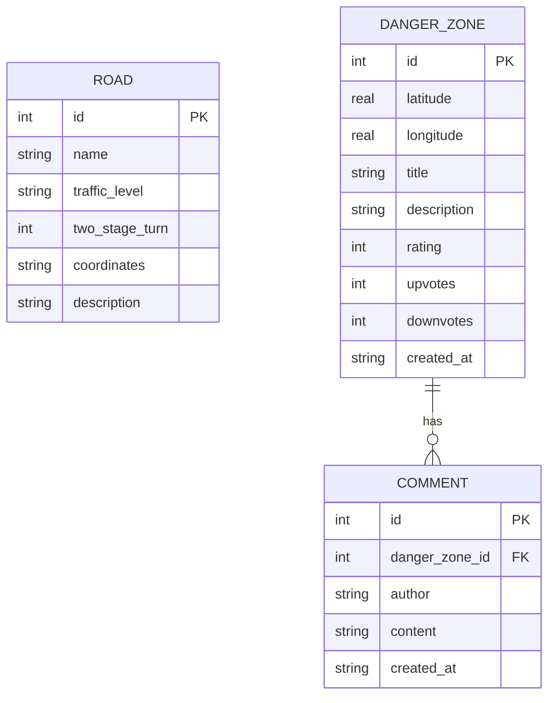

# 城市機車友善地圖與車流量查詢系統 - 資料庫設計 (DB_DESIGN)

本系統使用 SQLite 作為資料庫，實體檔案儲存於 `instance/database.db` 中。以下說明實體關係圖 (ERD)、資料表結構、建表 SQL 語法與 Model 設計。

## 1. 實體關係圖 (ER 圖)



---

## 2. 資料表詳細說明

### 2.1 `roads` (路段車流量與待轉資訊)
*   **用途**：儲存地圖上繪製路段（Polyline）所需的座標軌跡、路名、車流量狀態以及是否需要兩段式左轉。
*   **欄位說明**：

| 欄位名稱 | 資料型別 | 主鍵/外鍵 | 允許空值 | 預設值 | 說明 |
| :--- | :---: | :---: | :---: | :---: | :--- |
| `id` | `INTEGER` | PK | 否 | 自增 | 路段唯一識別碼 |
| `name` | `TEXT` | — | 否 | — | 路段名稱 (如: 福星路) |
| `traffic_level` | `TEXT` | — | 否 | 'low' | 車流量等級 (`low`: 順暢, `medium`: 壅塞, `high`: 紫爆) |
| `two_stage_turn`| `INTEGER` | — | 否 | 0 | 是否需要兩段式左轉 (0: 否, 1: 是) |
| `coordinates` | `TEXT` | — | 否 | — | 路段點位經緯度座標 JSON 字串 (如 `[[24.18, 120.64], ...]`) |
| `description` | `TEXT` | — | 是 | NULL | 其他備註或路面品質描述 |

---

### 2.2 `danger_zones` (危險路段回報點位)
*   **用途**：儲存使用者回報的危險點，包含位置座標、危險星級、文字描述以及投票統計。
*   **欄位說明**：

| 欄位名稱 | 資料型別 | 主鍵/外鍵 | 允許空值 | 預設值 | 說明 |
| :--- | :---: | :---: | :---: | :---: | :--- |
| `id` | `INTEGER` | PK | 否 | 自增 | 危險點唯一識別碼 |
| `latitude` | `REAL` | — | 否 | — | 緯度 (WGS84 座標) |
| `longitude` | `REAL` | — | 否 | — | 經度 (WGS84 座標) |
| `title` | `TEXT` | — | 否 | — | 簡短標題 (如: 福星文華路口易打滑) |
| `description` | `TEXT` | — | 否 | — | 詳細危險原因描述 |
| `rating` | `INTEGER` | — | 否 | 3 | 危險等級評分 (1-5 星) |
| `upvotes` | `INTEGER` | — | 否 | 0 | 使用者贊同數 (覺得實用) |
| `downvotes` | `INTEGER` | — | 否 | 0 | 使用者反對數 (覺得資訊有誤) |
| `created_at` | `TEXT` | — | 否 | 當前時間 | ISO 8601 格式時間字串 (如 `2026-06-02T17:40:00`) |

---

### 2.3 `comments` (危險路段留言板)
*   **用途**：針對特定危險路段，使用者可以進行後續討論與最新路況更新留言。
*   **欄位說明**：

| 欄位名稱 | 資料型別 | 主鍵/外鍵 | 允許空值 | 預設值 | 說明 |
| :--- | :---: | :---: | :---: | :---: | :--- |
| `id` | `INTEGER` | PK | 否 | 自增 | 留言唯一識別碼 |
| `danger_zone_id`| `INTEGER` | FK (danger_zones.id) | 否 | — | 所屬危險路段 ID (級聯刪除) |
| `author` | `TEXT` | — | 否 | '匿名騎士' | 留言發表者暱稱 |
| `content` | `TEXT` | — | 否 | — | 留言回覆內容 |
| `created_at` | `TEXT` | — | 否 | 當前時間 | ISO 8601 格式時間字串 |

---

## 3. SQL 建表語法 (database/schema.sql)

完整的 SQL 建表 DDL 已寫入 `database/schema.sql`，並在系統初始化時執行：

```sql
-- 啟用外鍵約束
PRAGMA foreign_keys = ON;

-- 建立路段表
CREATE TABLE IF NOT EXISTS roads (
    id INTEGER PRIMARY KEY AUTOINCREMENT,
    name TEXT NOT NULL,
    traffic_level TEXT NOT NULL CHECK(traffic_level IN ('low', 'medium', 'high')),
    two_stage_turn INTEGER NOT NULL CHECK(two_stage_turn IN (0, 1)) DEFAULT 0,
    coordinates TEXT NOT NULL,
    description TEXT
);

-- 建立危險點表
CREATE TABLE IF NOT EXISTS danger_zones (
    id INTEGER PRIMARY KEY AUTOINCREMENT,
    latitude REAL NOT NULL,
    longitude REAL NOT NULL,
    title TEXT NOT NULL,
    description TEXT NOT NULL,
    rating INTEGER NOT NULL CHECK(rating >= 1 AND rating <= 5) DEFAULT 3,
    upvotes INTEGER NOT NULL DEFAULT 0,
    downvotes INTEGER NOT NULL DEFAULT 0,
    created_at TEXT NOT NULL DEFAULT (datetime('now', 'localtime'))
);

-- 建立留言表
CREATE TABLE IF NOT EXISTS comments (
    id INTEGER PRIMARY KEY AUTOINCREMENT,
    danger_zone_id INTEGER NOT NULL,
    author TEXT NOT NULL DEFAULT '匿名騎士',
    content TEXT NOT NULL,
    created_at TEXT NOT NULL DEFAULT (datetime('now', 'localtime')),
    FOREIGN KEY (danger_zone_id) REFERENCES danger_zones(id) ON DELETE CASCADE
);
```

---

## 4. Python Model 檔案規劃

我們將在後端建立獨立的 Model 模組以抽離資料庫邏輯：
1.  **路段 Model** (`app/models/road.py`)：
    *   `get_all()`: 取得所有路段。
    *   `find_by_name(keyword)`: 模糊查詢路段名稱。
    *   `filter_by_traffic(level)`: 篩選符合車流量等級的路段。
2.  **危險點與留言 Model** (`app/models/danger_zone.py`)：
    *   `get_all()`: 取得所有危險點，並計算平均星級。
    *   `get_by_id(id)`: 取得單筆詳情。
    *   `create(data)`: 使用者提交新危險點。
    *   `vote(id, vote_type)`: 更新贊同/反對數。
    *   `add_comment(danger_zone_id, author, content)`: 新增留言。
    *   `get_comments(danger_zone_id)`: 讀取留言列表。
