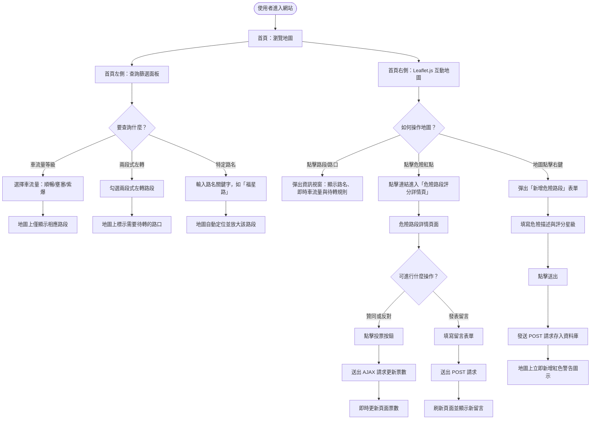
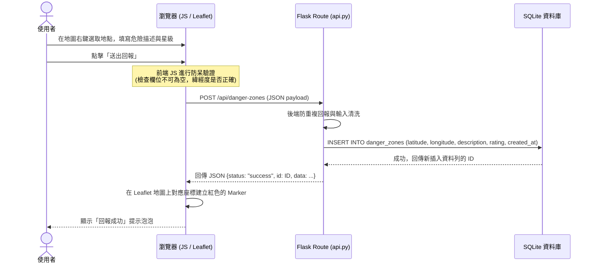
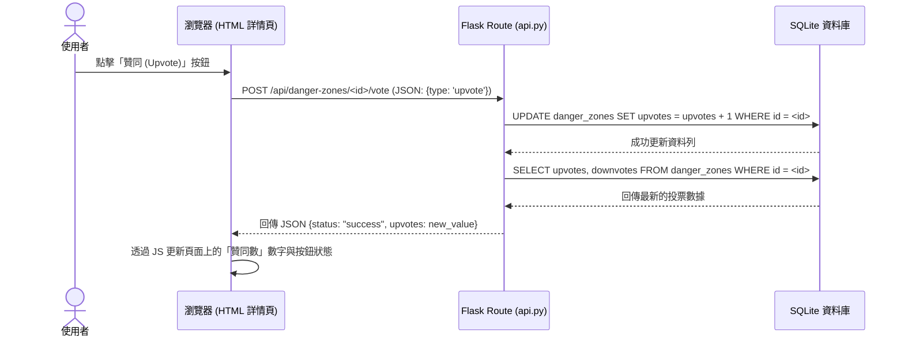

# 城市機車友善地圖與車流量查詢系統 - 系統與使用者流程圖 (FLOWCHART)

本文件使用 Mermaid 流程圖語法，視覺化展示使用者的操作路徑與系統內的資料傳遞序列，並附帶路由功能對照表。

## 1. 使用者流程圖 (User Flow)

描述使用者進入系統後，如何使用查詢面板、瀏覽地圖、進行車流量篩選、查看或回報危險路段等操作。

---

## 2. 系統序列圖 (Sequence Diagram)

以下是兩個核心情境的詳細系統序列：

### 情境 A：使用者在地圖上回報新的危險路段

### 情境 B：使用者對危險路段進行投票（贊同/反對）

---

## 3. 功能清單對照表

| 功能描述 | HTTP 方法 | URL 路徑 | 對應 HTML 模板 | 後端 Controller 與處理邏輯 |
| :--- | :---: | :--- | :--- | :--- |
| **首頁與地圖瀏覽** | `GET` | `/` | `templates/index.html` | `main.py` -> 渲染主頁面 (地圖框架) |
| **危險路段詳細資訊** | `GET` | `/danger-zones/<id>` | `templates/danger_zone_detail.html` | `main.py` -> 讀取特定危險點詳細星級、描述與留言列表 |
| **新增危險路段留言** | `POST` | `/danger-zones/<id>/comments` | — (重導向至詳情頁) | `main.py` -> 接收留言表單，存入 DB，重導向回詳情頁 |
| **取得所有路段及車流量**| `GET` | `/api/roads` | — (回傳 JSON) | `api.py` -> 查詢所有道路幾何與車流量狀態 |
| **取得所有危險標記點** | `GET` | `/api/danger-zones` | — (回傳 JSON) | `api.py` -> 查詢所有危險點位置與平均星級 |
| **新增危險標記點** | `POST` | `/api/danger-zones` | — (回傳 JSON) | `api.py` -> 接收地圖點擊新增的 JSON 資料並寫入 DB |
| **對危險標記進行投票** | `POST` | `/api/danger-zones/<id>/vote`| — (回傳 JSON) | `api.py` -> 更新特定危險點的贊同/反對數 |
