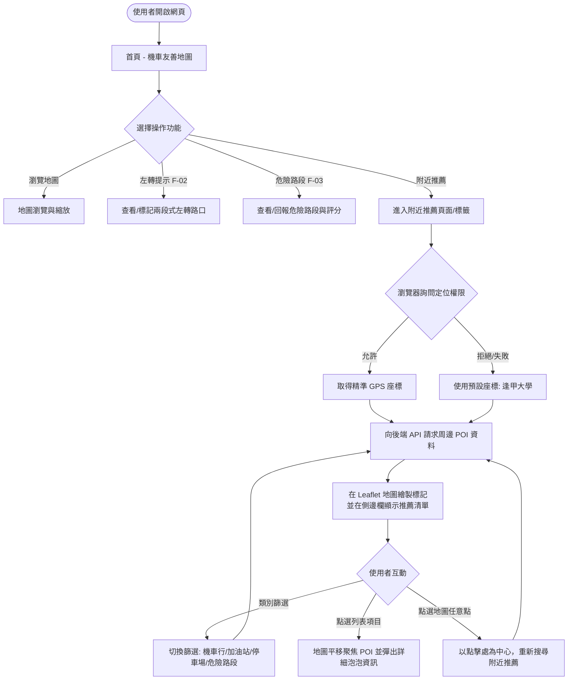
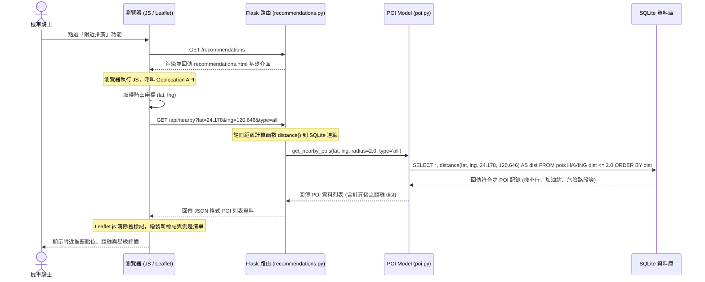

# 城市機車友善地圖系統 - 流程圖與資料流設計 (FLOWCHART)

本文件繪製本系統的**使用者流程圖 (User Flow)**與**系統序列圖 (Sequence Diagram)**，幫助開發團隊理解功能間的跳轉關係與後端資料傳輸流程。

## 1. 使用者流程圖 (User Flow)

此圖描述使用者進入系統後，如何操作各項功能，包括地圖瀏覽、兩段式左轉查詢、危險路段評分，以及新設計的**附近推薦功能**。

---

## 2. 系統序列圖 (Sequence Diagram)

此序列圖展示「附近推薦功能」在前後端與資料庫之間的資料傳輸與計算流程。

---

## 3. 功能清單與路由對照表

| 功能名稱 | HTTP 方法 | URL 路徑 | 對應 Jinja2 模板 | 說明 |
| :--- | :--- | :--- | :--- | :--- |
| **地圖首頁** | GET | `/` | `index.html` | 系統主地圖，整合基本查詢與顯示 (F-01) |
| **左轉提示清單** | GET | `/left_turn` | `left_turn/list.html` | 列表顯示所有標記之兩段式左轉路口 (F-02) |
| **新增左轉提示** | POST | `/left_turn/create` | — | 接收使用者標記左轉路口的表單並存入 DB |
| **危險路段評價** | GET | `/danger` | `danger/list.html` | 顯示危險路段評分與星級清單頁面 (F-03) |
| **新增危險回報** | POST | `/danger/create` | — | 接收危險路段回報表單並寫入 DB (F-03) |
| **附近推薦頁面** | GET | `/recommendations` | `recommendations/index.html` | 顯示附近推薦主頁與地圖 (新增功能) |
| **獲取周邊推薦 API**| GET | `/api/nearby` | — | JSON API，依座標、半徑、類型回傳推薦點 (新增功能) |
